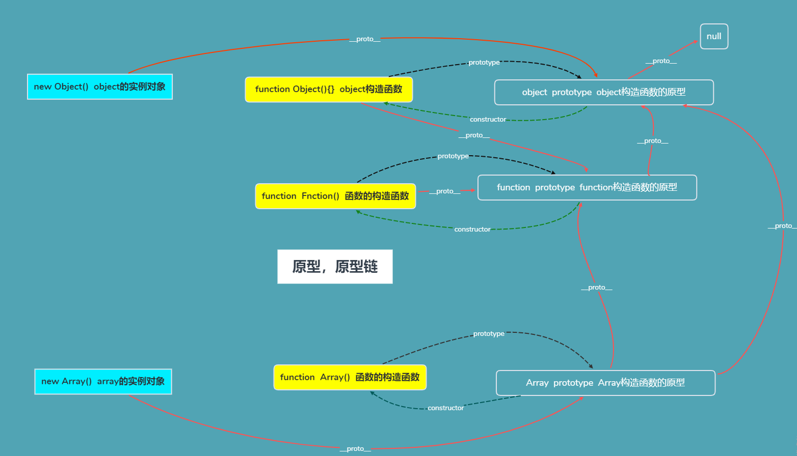

原型、原型链

#### 1、定义：实例对象、实例函数、实例函数的原型

- 实例对象由实例函数生成
- 实例函数可通过 prototype 操作实例函数的原型
- 实例对象的**proto**指向实例函数的原型，及实例对象继承实例函数原型的属性
- 实例函数的 prototype 等于实例函数原型
- 函数原型的 constructor 等于函数实例

#### 2、js 底层定义

- 所有函数的**proto**指向 js 函数原型
- js 函数原型**proto**指向 obj 的原型
- obj 的原型指向 null(防止循环，需要一个终点)

* [原型、原型链图解](https://github.com/zchfeng/js-base/tree/master/pages/prototype/index.png)
  
